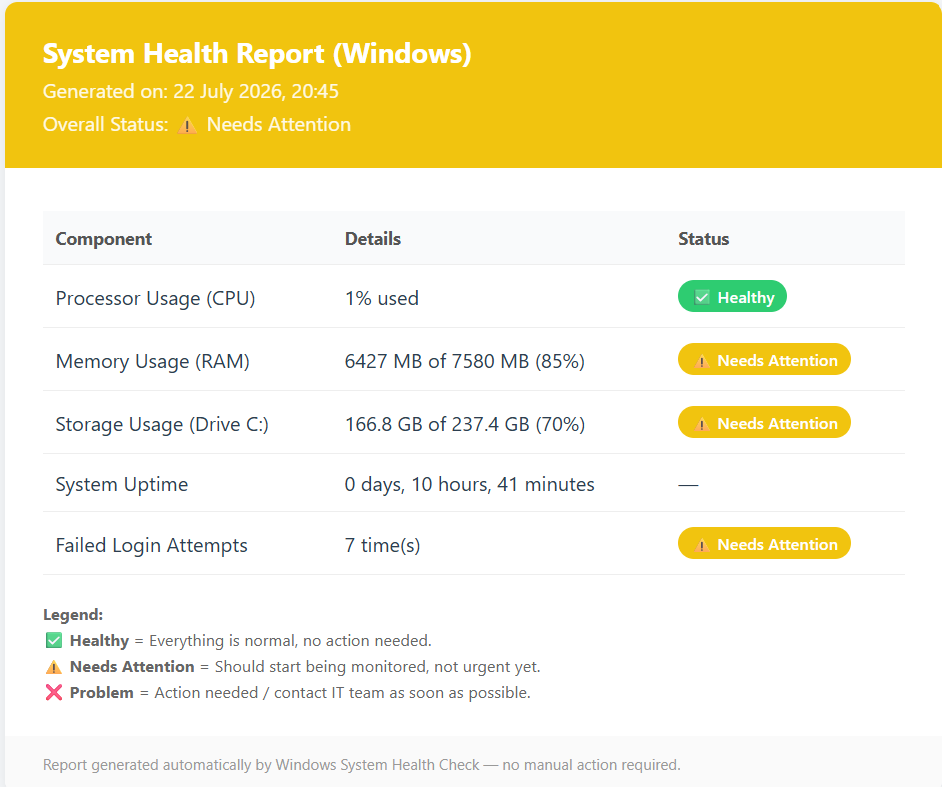

# 🤖 Automation

A collection of simple automation scripts built for a **Kali Linux lab environment** — designed so the results stay easy to read and understand for anyone, including people with **no Linux or technical background** (e.g. HR, managers, or non-IT staff).

Each script generates a **report as a web page (HTML)** with simple status indicators:

| Status | Meaning |
|--------|------|
| ✅ Healthy | Everything is running normally, no action needed |
| ⚠️ Needs Attention | Should start being monitored, not urgent yet |
| ❌ Problem | Action needed / contact IT team as soon as possible |

No terminal knowledge required to read the results — the report simply **opens in a browser** like a normal web page.

---

## 📸 Preview
 
| Linux | Windows |
|---|---|
|  |  |
 
---
## 📂 What's in This Repo

| Folder | For System | Script Language | Description |
|---|---|---|---|
| [`linux-health-check/`](./linux-health-check) | Linux / Kali Linux / WSL | Bash | Checks system health in a Linux environment |
| [`windows-health-check/`](./windows-health-check) | Windows | PowerShell | Checks the Windows laptop/PC health directly |

> 💡 **Which one should you use?**
> - Running native Kali Linux (VM, dual boot, or a physical lab machine) → use **`linux-health-check`**
> - Running Kali Linux via **WSL** on Windows and want to see the health of the **whole Windows laptop** (matching Task Manager) → use **`windows-health-check`**
> - WSL and Windows show different data because WSL only uses its own allocated share of resources, not the entire laptop's.

---

## 🩺 What Gets Checked?

Both versions check the same things, just read differently depending on Linux vs Windows:

1. **CPU** — whether the processor is under heavy load
2. **RAM** — whether memory is nearly full
3. **Disk/Storage** — whether storage space is running low
4. **Uptime** — how long the system has been running without a restart
5. **Failed Login Attempts** — a simple indicator of possible unauthorized access attempts

---

## 🚀 Quick Start

Don't use Git? Download without it

No terminal or Git knowledge needed:

Go to the top of this repo page
Click the green < > Code button
Select "Download ZIP"
Extract the ZIP file, then open the linux-health-check or windows-health-check folder

Using Git instead?

### For Linux / Kali Linux
```bash
cd linux-health-check
bash health_check.sh
```
📖 Full guide: [`linux-health-check/README.md`](./linux-health-check/README.md)

### For Windows
```powershell
cd windows-health-check
.\health_check.ps1
```
📖 Full guide: [`windows-health-check/README.md`](./windows-health-check/README.md)

---

## ⏰ Daily Automation

Both folders include a `setup_otomatis` script that only needs to be run **once**, so the report gets generated automatically every day at 08:00 without manual effort:

- Linux: `bash setup_otomatis.sh` (uses cron)
- Windows: `.\setup_otomatis.ps1` as Administrator (uses Task Scheduler)

---

## ❓ FAQ

**Does this script modify or damage the system?**
No. The script only *reads* the system's condition; it doesn't change any settings.

**Does it need an internet connection?**
No, all checks are performed locally.

**Who can read the report?**
Anyone — the report is intentionally written in simple language with color-coded indicators, without technical jargon, so HR or non-IT staff can understand the system's condition right away.

---

## 🛠️ Project Purpose

Built as a simple automation example from a Kali Linux lab, with a core focus: **the end result should remain readable and understandable by non-technical people**, not just the IT team.
